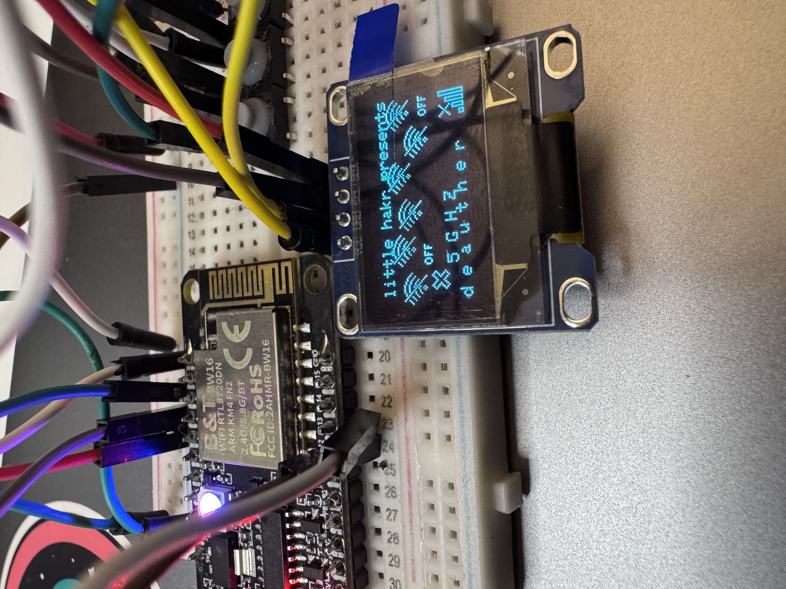

# RTL8720DN_SSD1306_FIX
A workaround for using SSD1306 displays w/ RTL8720DN (BW16).
 

## Usage
These files are normally located in your Arduino/libraries directory.
1) Backup corresponding folders! (However I don't believe this should interfere with other projects)
2) Add the folders to your libraries folder and replace.
3) This should now fix compatibility errors that may arrise. However create an issue or email me if you have other errors and I willt try to assist!
